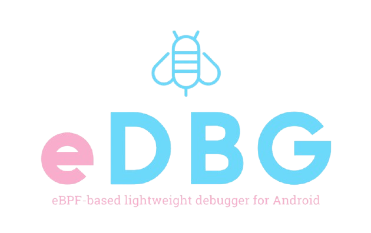

<h1>eDBG</h1>




> eDBG 是一款基于 eBPF 的轻量级 CLI 调试器。<br />
>
> 相比于传统的基于 ptrace 的调试器方案，eDBG 不直接侵入或附加程序，具有较强的抗干扰和反检测能力。

## ✨ 特性

- 支持类似 GDB 的交互方式，简单易上手
- 支持常规断点和单步调试功能，支持内存查看和寄存器查看
- 使用类似 [pwndbg](https://github.com/pwndbg/pwndbg) 的 CLI 界面，调试更便捷
- 基于 eBPF 实现，引入较少特征，难以被目标程序察觉

## 💕 演示

To do

## 🚀 运行环境

- 目前仅支持 ARM64 架构的 Android 系统，需要 ROOT 权限，推荐搭配 [KernelSU](https://github.com/tiann/KernelSU) 使用
- 系统内核版本5.10+ （可执行`uname -r`查看）

## ⚙️ 使用

从 Releases 或者下载最新预编译好的二进制即可

1. 推送到手机的`/data/local/tmp`目录下，添加可执行权限

   ```shell
   adb push eDBG /data/local/tmp
   adb shell
   su
   chmod +x /data/local/tmp/eDBG
   ```

2. 指定包名、库名、初始断点并运行调试器

   ```shell
   ./eDBG -p com.pakcage.name -l libname.so -b 0x123456
   ```

   由于本调试器不直接附加程序，因此无法在任意时刻暂停程序，需要手动添加初始触发断点来开启调试，断点为基于 `libname.so` 的偏移。

3. 运行被调试 APP

   如果被调试 APP 正在运行中，eDBG 也可以直接附加，但 eDBG 不会主动拉起被调试 APP。

## 💡命令说明

to do

## 🛫 编译

1. 环境准备

   本项目在 x86 Linux 下交叉编译

   ```
   sudo apt-get install golang
   sudo apt-get install clang
   ```

2. 编译

   ```
   git clone --recursive https://github.com/Sh11no/eDBG.git
   make
   ```

## 🤝 参考

- [SeeFlowerX/stackplz](https://github.com/SeeFlowerX/stackplz/tree/dev)
- [pwndbg](https://github.com/pwndbg/pwndbg)
